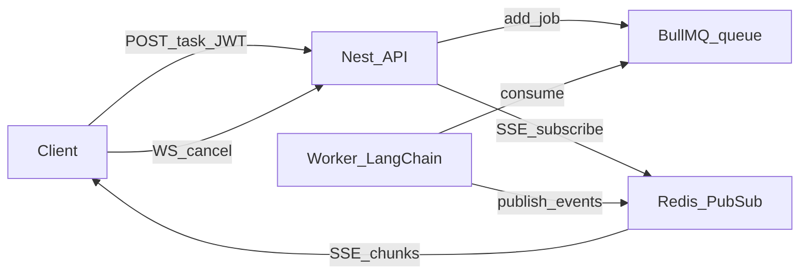

# 架构与目录

## 技术栈

| 类别 | 选型 |
|------|------|
| 框架 | NestJS 10 |
| HTTP 适配器 | Fastify（`@nestjs/platform-fastify`） |
| 数据库 | PostgreSQL，经 TypeORM 访问 |
| 缓存 / 队列 | Redis；BullMQ（长任务队列 + Pub/Sub 事件） |
| Agent 推理 | LangChain（`@langchain/openai` + `@langchain/core`），在**独立 Worker 进程**中执行 |
| 实时 | SSE（流式事件）、WebSocket（信令，如取消排队任务） |
| 认证 | JWT（`@nestjs/jwt`）+ Passport JWT（`passport-jwt`） |
| 密码 | bcryptjs（cost 12） |
| 校验 | class-validator / class-transformer（全局 `ValidationPipe`） |

## 目录结构

```
server/
├── docker-compose.yml      # 本地 PostgreSQL 16 + Redis 7
├── .env.example
├── nest-cli.json
├── package.json
├── tsconfig.json
├── tsconfig.build.json
└── src/
    ├── main.ts             # 入口：Fastify、全局校验、注册 Agent WebSocket、监听端口
    ├── worker.main.ts      # 独立进程：BullMQ Worker + LangChain
    ├── app.module.ts
    ├── app.controller.ts   # GET /health
    ├── database/
    │   └── typeorm.config.ts
    ├── redis/
    │   ├── redis.module.ts
    │   └── redis.tokens.ts
    ├── agent/
    │   ├── agent.module.ts
    │   ├── agent.controller.ts
    │   ├── agent-stream.controller.ts
    │   ├── agent-tasks.service.ts
    │   ├── agent-task.entity.ts
    │   ├── agent-ws.register.ts
    │   ├── agent.constants.ts
    │   ├── agent-events.ts
    │   └── dto/
    ├── worker/
    │   ├── worker.module.ts
    │   └── agent-worker.service.ts
    ├── common/
    │   └── current-user.decorator.ts
    ├── users/
    └── auth/
```

## 模块关系（简要）

- `AppModule`：全局 `ConfigModule`，`DATABASE_URL` 连接 PostgreSQL；`DATABASE_SYNC=true` 时 TypeORM **同步表结构**（仅建议本地）。
- `RedisModule`：全局 `IORedis`（`REDIS_URL`，`maxRetriesPerRequest: null` 与 BullMQ 兼容）。
- `UsersModule`：`User` 仓储与 `UsersService`。
- `AuthModule`：注册/登录、JWT 策略；**导出 `JwtModule`** 供 WebSocket 验签；`ProfileController` 提供 `/me`。
- `AgentModule`：BullMQ `Queue`（连接配置与顶层 `ioredis` 类型解耦）、`AgentTasksService`、`AgentController`、`AgentStreamController`。
- **Worker 进程**（`worker.main.ts` → `WorkerModule`）：TypeORM、`RedisModule`、`AgentWorkerService`；消费队列 `agent-tasks`，调用 LangChain，向 Redis 频道 `task:<taskId>:events` 发布 JSON；**不**监听 HTTP。

## Agent 数据流（概念）



Token 级流式走 **SSE**（`GET /agent/tasks/:id/stream`）。**WebSocket** 仅作信令（如取消仍在队列中的任务），避免与 SSE 重复推送同一生成内容。

细节见 [api-agent.md](./api-agent.md)。
